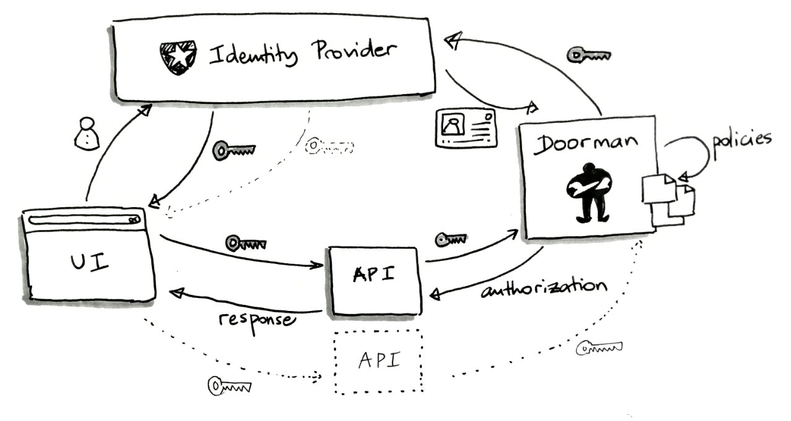

Welcome to Doorman's documentation!
===================================

.. image:: logo.svg

*Doorman* is an **authorization micro-service** that allows to checks if an arbitrary subject is allowed to perform an action on a resource, based on a set of rules (policies).

Having a centralized access control service has several advantages:

- it clearly dissociates authentication from authorization
- it provides a standard and generic permissions system to services developers
- it facilitates permissions management across services (eg. makes revocation easier)
- it allows authorizations monitoring, metrics, anomaly detection

Workflow
========

It relies on `OpenID Connect <https://en.wikipedia.org/wiki/OpenID_Connect>`_ to authenticate requests. The policies are defined per service and loaded in memory. Authorization requests are logged out.

When a service takes advantage of *Doorman*, a typical workflow is:

#. Users obtain an access token from an Identity Provider (eg. Auth0)
#. They use it to call a service API endpoint
#. The service posts an authorization request on *Doorman* to check if the user is allowed to perform a specific action
#. *Doorman* uses the ``Origin`` request header to select the set of policies to match
#. *Doorman* fetches the user infos using the provided access token and builds a list of strings (*principals*) to characterize this user
#. *Doorman* matches the policies and returns if allowed or not, along with the list of principals
#. Based on the *Doorman* response, the service denies the original request or executes it

Contents
========

.. toctree::
   :maxdepth: 2

   quickstart
   policies
   api
   misc

Indices and tables
==================

* :ref:`genindex`
* :ref:`modindex`
* :ref:`search`
