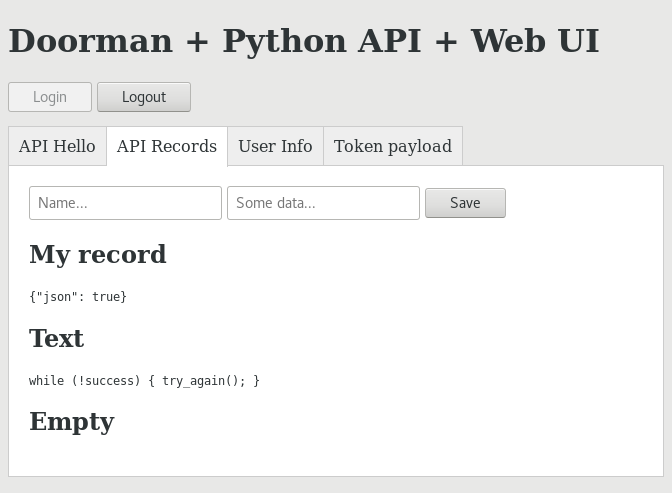

# Doorman + Python API + Web UI

A Web UI interacts with Auth0 and a Flask API:

* Some views are protected by a Python decorator
* The update view is protected by imperative code, where authors can only update their own records

## Run locally

Run those three services in separate terminals:

### Doorman

    make serve -e POLICIES=examples/python/policies.yaml

### Flask API

We use [Pipenv](https://docs.pipenv.org) to ease packages installation.

    cd examples/python/
    pipenv install
    pipenv run python server.py

### Web UI

Because of Auth0 configuration, we must access the Web UI on http://iam.local:3000/

Add this line to your `/etc/hosts`:

    127.0.0.1 iam.local

Serve the UI static files:

    cd examples/python/ui/
    python3 -m http.server 3000

Access http://iam.local:3000/
